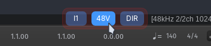

# Reaper things

## MiniFuse Control
A Lua-script for Reaper to control the Arturia Minifuse 1 and 2 audio cards, a wrapper for [minifuse-cli](https://github.com/zxsleebu/minifuse-cli) and [mf-cli](https://github.com/nolight132/mf-cli). This script will not work unless one of these applications is installed, depending on your operating system.



### Configuration

The configuration is done via `MiniFuse_Control.ini`.
These lines allows to specify the order of the buttons and to disable unnecessary ones:
```
button_order=I1,I2,48V,DIR
button_48V=1
button_DIR=1
button_I1=1
button_I2=0
```

Since I'm not a programmer, and this script is a product of vibe coding using ChatGPT and Copilot, I don't quite understand what's going on and I apologize for that. Some lines for customizing the appearance work, but I still couldn't get some things to work. If you understand this code and know how to fix it, you're welcome. Somehow it works for now and I have this little panel I wanted, so you can use it too.

### Linux
Just install [mf-cli](https://github.com/nolight132/mf-cli).

Currently mf-cli supports only one channel, so you can't switch Hi-Z on the second channel on MiniFuse 2. You can disable extra button through a configuration file if you don't need it.

### Windows
1. Download [Arturia MiniFuse CLI Control](https://github.com/zxsleebu/minifuse-cli)
2. Here you must specify the path to `python.exe` to launch the minifuse-cli and the path to the `minifuse-cli` itself:
```
python=C:\Python314\python.exe
script=D:\Tools\minifuse-cli\main.py
```
